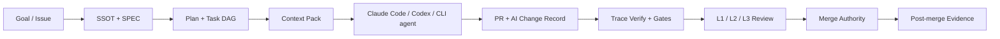

# Shirube Positioning

## 1. One-Line Position

Shirube is an AI Development OS and AI Coding Control Plane for Claude Code,
Codex, and future CLI coding agents.

It does not try to be another coding agent. It provides the development
structure around coding agents: specs, task state, context, evidence,
traceability, gates, and merge governance.

Short public promise:

> Make AI coding agents safe enough for real projects.

## 2. Why This Exists

AI coding breaks at scale when teams rely on ad hoc sessions and prose-only
handoffs:

- context fragments across chats, docs, issues, and PRs;
- architecture and implementation drift apart;
- specs, tests, operations, and code lose traceability;
- multi-agent work loses ownership and current-state clarity;
- reviewers cannot tell which evidence was produced by the agent;
- merge decisions become natural-language judgments instead of governed
  authority checks.

Shirube's job is to keep AI-assisted development structurally legible and
reviewable.

## 3. Category

Primary category:

```text
AI Development OS
```

Operational category:

```text
AI Coding Control Plane
```

Enterprise category:

```text
AI PR Safety Gate + Evidence Control Plane
```

Avoid positioning Shirube as:

- a generic AI code generator;
- a generic agent orchestration framework;
- a generic RAG or code-search product;
- a full AI Business OS.

The broader ecosystem may become an AI Business OS later. Shirube should first
win the AI-assisted software development domain.

## 4. Core Responsibilities

### 4.1 Development Structure

Shirube turns development intent into structured work:

- SSOT and feature specs;
- SPEC / IMPL / VERIFY / OPS documents;
- phase and task order;
- dependency-aware implementation flow;
- documented acceptance and non-goals.

### 4.2 Agent Execution Control

Shirube treats AI work as a lifecycle, not a free-form prompt:

- backlog, in progress, waiting input, auditing, review, done, failed;
- blockers and escalation triggers;
- heartbeat and lease expiry;
- stop reasons and acceptance checks;
- isolated worktree lanes for bounded parallel work.

### 4.3 Traceability

Shirube keeps development evidence connected:

```text
SPEC -> IMPL -> VERIFY -> OPS
```

The trace engine is deterministic. It is not an LLM review pass.

### 4.4 Merge Governance

AI can write code. Shirube controls whether the work has enough evidence and
authority to move toward merge.

Merge governance includes:

- route labels;
- configured authority roles;
- producer and approver separation;
- current-head review evidence;
- audit level expectations;
- explicit non-claims when a PR is not merge-ready.

## 5. Architecture Narrative



Current implementation already covers parts of this chain, including specs,
task/run state, trace verification, workflow checks, and merge authority.
Context Pack, AI Change Record, and richer GitHub Check projection are roadmap
items under the Phase 1/Phase 2 control-plane work.

## 6. Ecosystem Boundary

Shirube should remain agent-neutral and adapter-based.

| Component | Role |
|---|---|
| Claude Code / Codex | Execution agents that edit code and run tasks. |
| AUN | Communication and dispatch surface. |
| Wasurezu | Persistent memory and recovery context. |
| Kodama | External/context aggregation and future context-pack input. |
| Shirube | Structural governance, traceability, workflow state, evidence, and merge control. |

None of AUN, Wasurezu, or Kodama is a required core dependency for local Shirube
use. They are integrations.

## 7. Current Public Message

Use:

- AI Development OS for Claude Code and Codex;
- AI Coding Control Plane;
- structural governance for AI-assisted development;
- spec-aware development runtime;
- evidence-first control plane for AI-generated PRs.

Avoid:

- "another AI coding framework";
- "AI Business OS" for Shirube standalone;
- claims that Shirube replaces human audit or merge authority.

## 8. Adoption Story

For individual developers:

> Shirube helps AI agents work from specs, produce evidence, and avoid drifting
> away from the intended architecture.

For teams:

> Shirube makes AI-generated work reviewable through traceability, gates,
> role-aware workflow, and PR evidence.

For enterprises:

> Shirube can become the evidence and merge-safety layer across multiple AI
> coding agents and repositories.

## 9. Product Direction

Near-term roadmap priorities that support this positioning:

1. Context Pack generation for task-aware agent execution.
2. AI Change Record for every AI-assisted PR.
3. PR evidence report and GitHub Check projection.
4. Trace impact and trace graph explainability.
5. Session observability for agent runs.
6. Public release hygiene: package version clarity, install path, provider
   permission warnings, and supported frontmatter syntax.

These are direction statements, not completion claims. Public readiness still
requires reviewed implementation and GitHub evidence.
