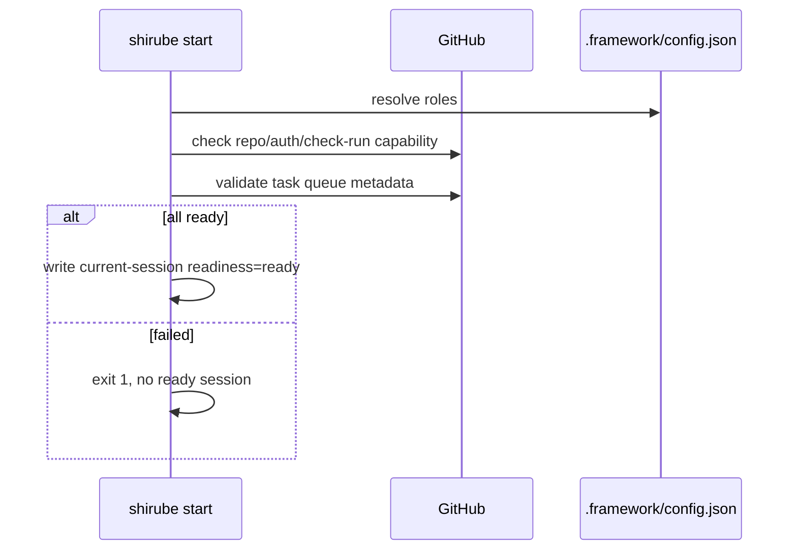
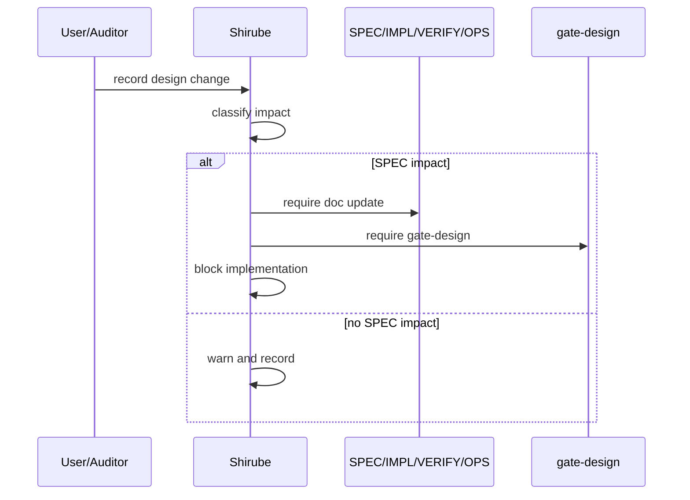

# IMPL: Shirube v1.2.0 Completion — GitHub-Backed Strict Workflow

## 0. 対応する SPEC
`docs/spec/v1.2.0-github-backed-strict-workflow.md` / SPEC-DOC4L-018。

## 1. 実装分割

### PR A: GitHub readiness gate for strict start
- Add GitHub readiness probe module.
- Check `gh` availability, auth, repo metadata, remote origin.
- Wire readiness into `start --audit-level strict`.
- Persist readiness warnings/errors into current session.
- Tests: no `gh`, no auth, non-GitHub remote, happy path via mocked executor.

### PR A2: Adoption lifecycle state model
- Make docs and CLI guidance distinguish the three target states:
  - S1 greenfield: `shirube init` then `shirube start`
  - S2 midstream adoption: `shirube retrofit --scan-only`, `retrofit --generate`, then `shirube start`
  - S3 managed resume/update: `shirube update` when needed, `roles doctor`, then `start --resume` or `start --force`
- Ensure `init`, `retrofit`, and `update` never mark development as framework-led by themselves.
- Ensure `start` is the only command family that creates or reactivates the framework-led session boundary.
- Tests: greenfield init path, midstream retrofit path, managed update/resume path, update preserving config before restart.

### PR B: GitHub task sequence validator
- Define canonical sequence metadata representation.
- Parse sequence from GitHub Issues.
- Detect missing, duplicate, invalid format, closed/open mismatch.
- Add `shirube queue doctor` or extend `shirube sync`/`next`.
- Tests: duplicate seq, missing seq, invalid seq, stable sort.

### PR C: Deterministic next task from GitHub SSOT
- Make `shirube next --json` use GitHub-backed queue in `standard` / `strict`.
- Fail closed on ambiguous queue.
- Keep local cache fallback only for `minimal` / offline draft.
- Tests: one eligible task, blockers, in-progress guard, ambiguous queue.

### PR D: Resequence writes GitHub + local cache
- Update `shirube resequence` to write canonical GitHub metadata.
- Preserve idempotency.
- Add dry-run output.
- Tests: insertion, gap allocation, resequence, retry-safe update.

### PR E: Design-change intake
- Add a design-change record path.
- Classify SPEC/IMPL/VERIFY/OPS impact.
- Mark active session as blocked when SPEC-impacting change appears.
- Require `/gate-design` before resuming implementation.
- Tests: SPEC-impact blocks, IMPL-only warns, resume after gate.

### PR F: Update config preservation
- Ensure `shirube update` preserves concrete role bindings.
- Fill missing required roles with placeholders only.
- Document operator-owned config.
- Tests: configured roles survive update, missing `l3_governance_owner` is added.

### PR G: v1.2.0 strict dogfooding E2E
- Automate or semi-automate the completion smoke.
- Flow variants:
  - S1: init -> roles -> strict start -> design -> implement -> gate -> review -> exit -> resume.
  - S2: retrofit scan/generate -> roles -> strict start -> design/implementation handoff -> gate -> review.
  - S3: update -> roles doctor -> strict resume or force-start -> gate cache refresh -> resume work.
- Link evidence from Shirube self-dogfood and kodama application.

## 2. 主要モジュール案

```text
src/cli/lib/github-readiness.ts
src/cli/lib/task-sequence.ts
src/cli/lib/github-task-queue.ts
src/cli/lib/design-change.ts
src/cli/commands/queue.ts
src/cli/commands/design-change.ts
```

Existing modules to modify:

```text
src/cli/commands/start.ts
src/cli/commands/next.ts
src/cli/commands/sync.ts
src/cli/commands/resequence.ts
src/cli/commands/update.ts
src/cli/lib/sync-engine.ts
src/cli/lib/resequence-engine.ts
src/cli/lib/run-engine.ts
src/cli/lib/workflow-config.ts
```

## 3. データ構造

### 3.1 GitHub task metadata
Implementation must choose and freeze one canonical representation:

```json
{
  "shirube": {
    "type": "task",
    "taskId": "QUEUE-001-IMPL",
    "featureId": "QUEUE-001",
    "seq": "1000100010",
    "blockedBy": [],
    "status": "backlog"
  }
}
```

Recommended location: issue body `adf-meta` JSON block. Labels and Project fields may mirror it but are not SSOT unless explicitly selected.

### 3.2 Design-change record
```json
{
  "id": "DC-20260521-001",
  "source": "user",
  "recordedAt": "2026-05-21T00:00:00.000Z",
  "impact": ["SPEC", "IMPL"],
  "affectedDocs": [
    "docs/spec/v1.2.0-github-backed-strict-workflow.md"
  ],
  "requiredGate": "/gate-design",
  "status": "blocked_until_gate",
  "authority": "l3_governance_owner"
}
```

## 4. シーケンス

### 4.1 Strict start


### 4.2 Design change during active session


## 5. 実装順序
1. PR F (#171) first: update safety before broad application to kodama.
2. PR A + PR A2: strict GitHub readiness and lifecycle state guidance.
3. PR B: queue validation.
4. PR C + D: autonomous next/resequence.
5. PR E (#167): design-change intake.
6. PR G (#169): v1.2.0 completion smoke across Shirube and kodama.

## 6. 移行方針
- Existing projects may keep local-only `minimal` operation.
- Existing `standard`/`strict` projects must run queue migration.
- Missing sequence metadata blocks autonomous execution but does not delete tasks.
- Missing `l3_governance_owner` is filled as placeholder on update and blocks strict until configured.

## 7. トレース
| SPEC FR | Implementation slice |
|---|---|
| FR-001 | PR A docs/start policy |
| FR-002 | PR A2 lifecycle state model |
| FR-003 | PR A `github-readiness` |
| FR-004 | PR B/C `task-sequence`, `next` |
| FR-005 | PR D `resequence` |
| FR-006 | PR E `design-change` |
| FR-007 | PR E session/GitHub audit trail |
| FR-008 | PR F update preservation |

## §Evidence
- Existing commands: `src/cli/commands/start.ts`, `next.ts`, `sync.ts`, `resequence.ts`, `update.ts`.
- Existing queue design: `docs/TASK-SEQUENCE-DESIGN.md`.
- Current gaps are tracked by #167, #169, #171, #178.
