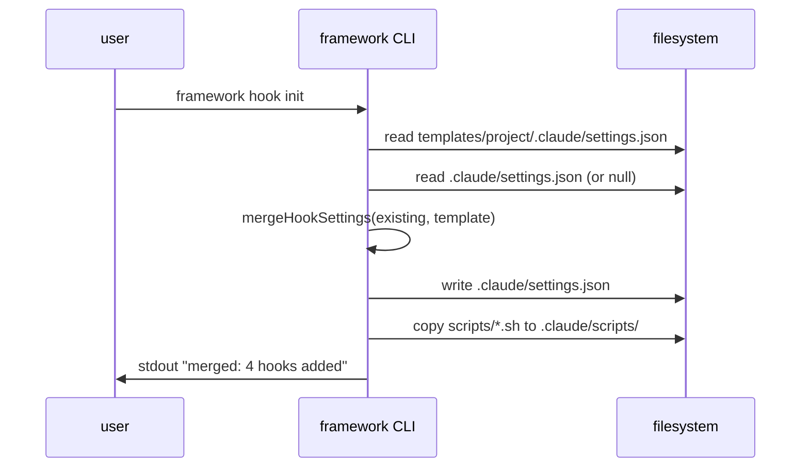

# IMPL: ADF v1.2.1 — Claude Code Hooks 基盤統合

## 0. 対応する SPEC [必須]

SPEC-DOC4L-008 (`docs/spec/v1.2.1-hooks.md`) の FR-001〜FR-005 を実装する。

## 1. 配置図 [必須]

### 1.1 新規ファイル

| path | 種別 | 概要 |
|---|---|---|
| `templates/project/.claude/settings.json` | template | F1 settings.json template (4 種 hook) |
| `templates/project/.claude/scripts/post-edit-verify.sh` | script | F4-1 PostToolUse |
| `templates/project/.claude/scripts/stop-verify.sh` | script | F4-2 Stop |
| `templates/project/.claude/scripts/inject-spec-context.sh` | script | F4-3 SessionStart |
| `templates/project/.claude/scripts/block-dangerous.sh` | script | F4-4 PreToolUse |
| `src/cli/commands/hook/init.ts` | TS | `framework hook init` |
| `src/cli/commands/hook/validate.ts` | TS | `framework hook validate` |
| `src/cli/commands/hook/test.ts` | TS | `framework hook test` |
| `src/cli/commands/hook/list.ts` | TS | `framework hook list` |
| `src/cli/commands/hook/index.ts` | TS | subcommand router |
| `src/lib/hooks/settings-merger.ts` | TS | F1 merge logic |
| `src/lib/hooks/spec-compliance.ts` | TS | F2 公式仕様 check |
| `src/lib/hooks/log.ts` | TS | hook 実行 audit log writer |

### 1.2 変更ファイル

| path | 概要 |
|---|---|
| `src/cli/index.ts` | `hook` subcommand register |
| `templates/project/docs/spec/_template.md` | §「検証層の構造」章追加 (F3) |
| `templates/project/docs/impl/_template.md` | §「検証層の構造」impl 詳細章追加 (F3) |
| `docs/specs/SPEC-INDEX.md` | v1.2.1 entry 追加 |
| `package.json` | hook 関連 dependency (jq 不要、bash + node std で完結) |

### 1.3 削除ファイル [該当時]

なし。

## 2. 型定義 [必須]

### 2.1 データ型 (TypeScript)

```ts
// src/lib/hooks/types.ts
export interface HookEntry {
  matcher?: string;          // 例: "Bash" / "Write|Edit|MultiEdit"
  hooks: Array<{
    type: 'command';
    command: string;         // $CLAUDE_PROJECT_DIR/... prefix 必須
  }>;
}

export interface HookSettings {
  hooks: {
    PostToolUse?: HookEntry[];
    Stop?: HookEntry[];
    SessionStart?: (HookEntry & { matcher?: 'startup' | 'resume' | 'compact' })[];
    PreToolUse?: HookEntry[];
  };
}

export interface HookValidationResult {
  ok: boolean;
  errors: Array<{ event: string; index: number; reason: string }>;
}

export interface HookLogEntry {
  ts: string;                // ISO 8601
  event: string;             // 'PreToolUse' / 'Stop' / ...
  matcher: string | null;
  command: string;
  exit_code: number;
  duration_ms: number;
  reason: string | null;     // exit 2 時の stderr first line
}
```

### 2.2 関数シグネチャ

```ts
// settings-merger.ts
export function mergeHookSettings(
  existing: HookSettings | null,
  template: HookSettings,
  opts: { force?: boolean }
): { merged: HookSettings; conflicts: string[] };

// spec-compliance.ts
export function validateHookSettings(s: HookSettings): HookValidationResult;

// log.ts
export function appendHookLog(entry: HookLogEntry): Promise<void>;
```

### 2.3 API 契約

該当なし (CLI のみ、HTTP API 不在)。

## 3. シーケンス [必須]

### 3.1 正常系フロー (`framework hook init`)



### 3.2 トランザクション境界

`framework hook init` は: (1) 既存 settings.json バックアップ (`*.bak.{ts}`)、(2) merge result 書込、(3) script copy。途中失敗時はバックアップから復元 (try/catch + finally)。

### 3.3 並行性 [該当時]

CLI single process 前提、並行起動は file lock で防ぐ (`.framework/hook-init.lock`)。

## 4. エラー処理 [必須]

### 4.1 例外分類

| 例外名 | 発生条件 | 伝播先 | ユーザー表示 | 終了コード |
|---|---|---|---|---|
| `SettingsConflictError` | 既存 settings.json と key 衝突、`--force` なし | CLI top-level | "Conflict at hooks.PreToolUse[0]; use --force" | 2 |
| `HookSpecViolationError` | `framework hook validate` で仕様違反 | CLI top-level | error list table | 2 |
| `HookScriptCrashError` | hook 実行時 script が non-zero 以外で crash | hook log + warn | warn log | 0 (bot session 継続) |
| `LockTimeoutError` | hook-init.lock 取得失敗 | CLI top-level | "Another framework hook init in progress" | 1 |

### 4.2 リトライ方針

なし。CLI 1 回起動 = 1 回実行、retry はユーザー判断。

### 4.3 フォールバック [該当時]

`framework hook init` は backup から自動 rollback (§3.2)。それ以外 fallback 不要。

## 5. 既存コードとの取り合い [必須]

### 5.1 依存する既存モジュール

- `src/cli/index.ts` (subcommand registration、既存 pattern に追加)
- `src/lib/fs.ts` (既存 file utility)
- `src/lib/json.ts` (既存 JSON parser)
- `templates/project/docs/{spec,impl,verify,ops}/_template.md` (F3 で section 追加)

### 5.2 拡張する既存関数

- `src/cli/commands/init.ts` の `framework init` から `framework hook init` を chain (option flag で skip 可能)
- `templates/project/.claude/settings.json` がない repo では空 template 想定、新規生成で対応

### 5.3 非互換変更の有無

- 既存 settings.json を持つ repo に `framework hook init` を実行すると 4 hook が追加される (additive)
- key conflict 時は `--force` 必須 = breaking ではないが review 必要
- hook log dir `.framework/hook-log/` 新設、`.gitignore` に追加 (run-state と同様)

## 6. ログ出力 [必須]

### 6.1 出力ポイント

| event | path | format | trigger |
|---|---|---|---|
| hook init success | stdout | text | `framework hook init` |
| hook validation result | stdout (table) | text | `framework hook validate` |
| hook execution audit | `.framework/hook-log/{date}.jsonl` | JSONL | 各 hook 発火後 (script 終端で append) |
| hook script crash | stderr + `.framework/hook-log/error/{date}.log` | text | script crash 時 |

### 6.2 監視連携 [該当時]

OPS-DOC4L-008 §3 監視項目で metrics 化 (hook block rate / hook crash rate / hook duration p95)。

## 7. 設定値 [該当時]

| env var | default | 用途 |
|---|---|---|
| `ADF_HOOK_DRY_RUN` | `0` | `1` で hook が exit 2 を返さず log のみ (canary) |
| `ADF_HOOK_LOG_RETENTION_DAYS` | `30` | hook-log 保持日数 |
| `CLAUDE_PROJECT_DIR` | (Claude Code 提供) | hook script の portable path 起点 |

## 8. セキュリティ [SPEC §6.3 の実装詳細]

- hook script は repo 内のみ参照、外部 fetch 禁止 (template default)
- `block-dangerous.sh` の pattern は `templates/project/.claude/scripts/block-dangerous.sh` に hard-coded、override は project 配下 fork 必須 (PR review 経由のみ)
- hook-log は PII を含まない (command 全文 log のみ、stdin / stdout は記録しない)
- `framework hook validate --strict` で settings.json 内の `command` field に suspicious pattern (`curl`, `wget`, `nc`) があれば warn

## 9. トレース [必須]

| FR | impl files |
|---|---|
| SPEC-DOC4L-008-FR-001 | `settings-merger.ts` + `templates/project/.claude/settings.json` + `cli/commands/hook/init.ts` |
| SPEC-DOC4L-008-FR-002 | `cli/commands/hook/{init,validate,test,list}.ts` + `spec-compliance.ts` |
| SPEC-DOC4L-008-FR-003 | `templates/project/docs/{spec,impl}/_template.md` |
| SPEC-DOC4L-008-FR-004-1 (PostToolUse) | `templates/project/.claude/scripts/post-edit-verify.sh` |
| SPEC-DOC4L-008-FR-004-2 (Stop) | `templates/project/.claude/scripts/stop-verify.sh` |
| SPEC-DOC4L-008-FR-004-3 (SessionStart) | `templates/project/.claude/scripts/inject-spec-context.sh` |
| SPEC-DOC4L-008-FR-004-4 (PreToolUse) | `templates/project/.claude/scripts/block-dangerous.sh` |
| SPEC-DOC4L-008-FR-005 | 全 hook script で `$CLAUDE_PROJECT_DIR` prefix 使用 |
