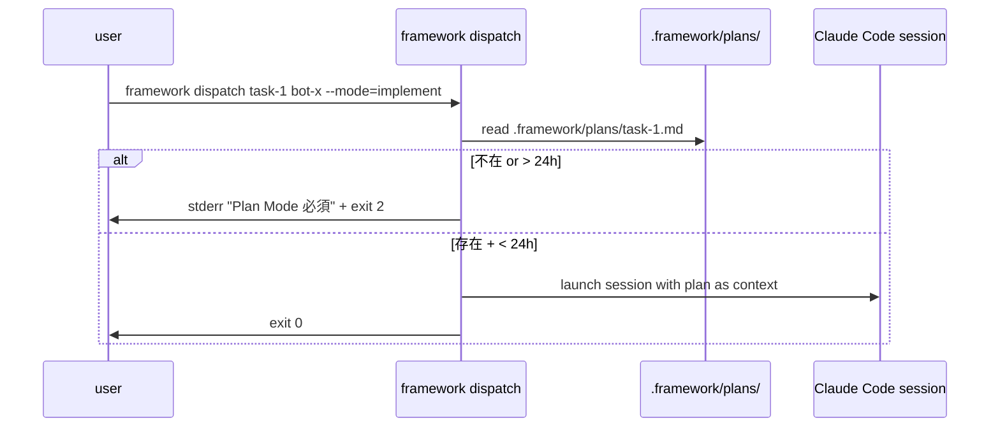
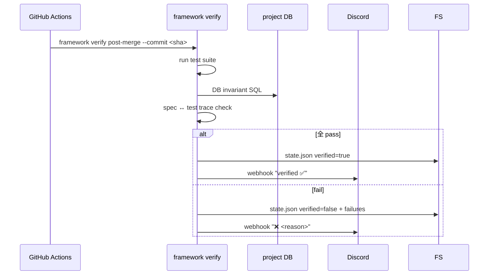

# IMPL: ADF v1.2.2 — 高度 hook + Plan Mode + Verify 強化

> Honesty labels: [検証済] / [文献確認] / [推測] を全 claim に付与する。

## 0. 対応する SPEC [必須]

[文献確認: `docs/spec/v1.2.2-plan-verify.md`] SPEC-DOC4L-009 の FR-001〜FR-005 を実装する。

## 1. 配置図 [必須]

### 1.1 新規ファイル

[文献確認: 起点 proposal `proposals/v1.2.x/adf-v1.2.x-spec-proposal.md` §3 機能要件]:

| path | 種別 | 概要 |
|---|---|---|
| `templates/project/.claude/scripts/inject-spec-context.sh` (拡張) | script | F1-1 SessionStart で Plan ファイル check 追加 |
| `templates/project/.framework/hooks/label-check.sh` | script | F2 + F3 (label + citation) |
| `templates/project/.github/workflows/post-merge-verify.yml` | yml | F4 GH Actions |
| `src/cli/commands/dispatch.ts` | TS | `framework dispatch` (新設) |
| `src/cli/commands/verify/post-merge.ts` | TS | `framework verify post-merge` |
| `src/cli/commands/verify/status.ts` | TS | `framework verify status` |
| `src/cli/commands/verdict/log.ts` | TS | `framework verdict log` |
| `src/cli/commands/verdict/recent.ts` | TS | `framework verdict recent` |
| `src/lib/dispatch/plan.ts` | TS | Plan Mode session orchestration |
| `src/lib/dispatch/implement.ts` | TS | implement Mode preflight (Plan check) |
| `src/lib/verify/post-merge.ts` | TS | verify pipeline |
| `src/lib/verify/state.ts` | TS | `.framework/verify/state.json` reader/writer |
| `src/lib/verdict/store.ts` | TS | verdict file IO |
| `src/lib/label/check.ts` | TS | label-check.sh の core logic を Node 実装で TS 化 (test 容易) |
| `src/lib/label/citation.ts` | TS | citation 検証 logic |

### 1.2 変更ファイル

[推測: v1.2.1 implementation 後の状態を前提]:

| path | 概要 |
|---|---|
| `templates/project/.claude/scripts/inject-spec-context.sh` | F1-1 追加 |
| `templates/project/.claude/settings.json` | label-check.sh を Stop hook に追加 |
| `src/cli/index.ts` | `dispatch` / `verify` / `verdict` subcommand register |
| `templates/project/docs/{spec,impl,verify,ops}/_template.md` | Plan / verdict 参照を OPS template に追加 |
| `docs/specs/SPEC-INDEX.md` | v1.2.2 entry 追加 |

### 1.3 削除ファイル [該当時]

なし。[文献確認: SPEC-DOC4L-009 §2 Non-goals] v1.2.1 hook script は維持 (拡張のみ)。

## 2. 型定義 [必須]

### 2.1 データ型 (TypeScript) [推測: init draft、実装段で contract test と整合]

```ts
// src/lib/dispatch/types.ts
export type DispatchMode = 'plan' | 'implement';

export interface DispatchOpts {
  taskId: string;
  bot: string;
  mode: DispatchMode;
  bypassPlan?: boolean;  // ADF_PLAN_BYPASS=1
}

export interface PlanFile {
  path: string;          // .framework/plans/<task-id>.md
  taskId: string;
  bot: string;
  mtime: Date;
  content: string;
}

// src/lib/verify/types.ts
export interface VerifyState {
  commit: string;
  verified: boolean;
  ts: string;
  failures: string[];
}

// src/lib/verdict/types.ts
export type VerdictType =
  | 'audit-pass' | 'audit-block'
  | 'spec-decision'
  | 'governance-violation-detected'
  | 'drift-found'
  | 'dispatch-completed';

export interface VerdictEntry {
  bot: string;
  type: VerdictType;
  ts: string;
  path: string;          // .framework/verdicts/<bot>/<ts>-<type>.md
  summary: string;
}

// src/lib/label/types.ts
export interface AssertionMatch {
  text: string;
  line: number;
  hasLabel: boolean;
  labelType: '検証済' | '文献確認' | '推測' | null;
}

export interface CitationMatch {
  file: string;
  lineRange: { start: number; end: number };
  quoted: string;
  matched: boolean;
  actual: string | null;
}
```

### 2.2 関数シグネチャ [推測: draft]

```ts
// dispatch
export function dispatchPlan(opts: DispatchOpts): Promise<{ planPath: string }>;
export function dispatchImplement(opts: DispatchOpts): Promise<void>;
export function checkRecentPlan(taskId: string, withinMs: number): PlanFile | null;

// verify
export function verifyPostMerge(commit: string): Promise<VerifyState>;
export function readVerifyState(commit: string): VerifyState | null;

// verdict
export function logVerdict(bot: string, type: VerdictType, content: string): Promise<VerdictEntry>;
export function recentVerdicts(bot: string, limit: number): VerdictEntry[];

// label / citation
export function findUnlabeledAssertions(transcript: string): AssertionMatch[];
export function verifyCitations(transcript: string, projectDir: string): CitationMatch[];
```

### 2.3 API 契約

[文献確認: SPEC-DOC4L-009 §5.3] Discord webhook 投稿のみ HTTP (template config で URL 指定)。HTTP API は本 spec scope 外。

## 3. シーケンス [必須]

### 3.1 Plan Mode 必須 flow [推測: init draft、SPEC §4.1 を sequence 化]



### 3.2 post-merge verify flow [推測: init draft、SPEC §4.4 を sequence 化]



### 3.3 並行性 [該当時]

[推測: 設計 init]:
- `framework verify` は GH Actions runner 内 single process
- `verdict log` 連続呼出は file lock (timestamp 衝突回避は ms 解像度 + uuid suffix)

## 4. エラー処理 [必須]

### 4.1 例外分類 [推測: init draft]

| 例外名 | 発生条件 | 伝播先 | ユーザー表示 | 終了コード |
|---|---|---|---|---|
| `PlanRequiredError` | implement mode + Plan ファイル不在 | CLI top-level | "Plan Mode 必須、--mode=plan で先に調査" | 2 |
| `PlanStaleError` | Plan mtime > 24h | CLI top-level | "Plan が古い (24h 超)、再実行を推奨" | 2 |
| `VerifyFailureError` | post-merge verify で 1 つ以上 fail | CLI top-level | failure list | 2 |
| `LabelViolationError` | label check で違反検出 | Stop hook JSON | `decision: block` | 0 (JSON で block) |
| `FakeCitationError` | citation 検証で hallucinate | Stop hook JSON | `decision: block` | 0 (JSON で block) |
| `BypassUsedWarning` | `ADF_PLAN_BYPASS=1` 使用 | audit log + Discord | warn (block ではない) | 0 |

### 4.2 リトライ方針

[文献確認: SPEC §6.2]:
- post-merge verify は 1 回実行、failure 時は別 commit で再実行 (auto retry なし)
- label / citation check は session 内 1 回判定、bot が修正した output で再 trigger

### 4.3 フォールバック [該当時]

[推測: fail-open 設計、本日 hook 設計議論で確認]:
- transcript log 取得失敗時は label check skip + warn log (bot 進行は block しない、`fail open`)
  - 理由: hook 自体の bug で全 bot 停止のリスク回避
- Discord webhook 失敗は warn のみ (verify 結果は state.json が SoT)

## 5. 既存コードとの取り合い [必須]

### 5.1 依存する既存モジュール [文献確認: v1.2.1 SPEC-DOC4L-008 / IMPL-DOC4L-008]

- v1.2.1 settings.json template (Stop hook の追加先)
- v1.2.1 `inject-spec-context.sh` (F1-1 拡張先)
- 既存 `src/cli/commands/init.ts` (subcommand pattern)
- 既存 `framework verify` があれば拡張、なければ新設 [推測: repo 状態未検証、impl 段で grep 必須]

### 5.2 拡張する既存関数

[推測: draft]:
- `inject-spec-context.sh`: implementation session detection 追加 + plan check
- `framework verify` (既存有無は repo 状態で判定): post-merge / status の 2 サブを追加

### 5.3 非互換変更の有無

[文献確認: SPEC §8 前提・依存]:
- Plan Mode 必須化は **opt-in** で導入 (`ADF_PLAN_REQUIRED=1` env を repo `.framework/config.json` で有効化)
- v1.2.2 dogfooding 完了後にデフォルト有効化を別 PR で議論
- 既存 dispatch flow を持つ project には breaking change の可能性、移行 guide を OPS-DOC4L-009 に記載

## 6. ログ出力 [必須]

### 6.1 出力ポイント [推測: init draft、proposal §3.5 verdict persist 規定に準拠]

| event | path | format | trigger |
|---|---|---|---|
| dispatch | `.framework/audit/{date}.jsonl` | JSONL | dispatch 全実行 |
| verify result | stdout (CLI) + `.framework/verify/state.json` (永続) | JSON | verify post-merge 実行後 |
| verdict log | `.framework/verdicts/<bot>/<ts>-<type>.md` + `MEMORY.md` link append | md + link | verdict log 実行時 |
| label / citation block | `.framework/hook-log/{date}.jsonl` | JSONL | Stop hook 発火時 |
| bypass usage | `.framework/audit/bypass-{date}.log` + Discord | text + webhook | `ADF_PLAN_BYPASS=1` 使用時 |

### 6.2 監視連携 [該当時]

[文献確認: OPS-DOC4L-009 §3] metrics 化 (label block rate / citation hallucinate rate / post-merge verify success rate / bypass usage count)。

## 7. 設定値 [該当時]

[文献確認: SPEC §6.2 + §9 リスク緩和]:

| env var | default | 用途 |
|---|---|---|
| `ADF_PLAN_REQUIRED` | `0` | `1` で Plan Mode を hard 必須化 |
| `ADF_PLAN_TTL_HOURS` | `24` | Plan ファイル の有効時間 |
| `ADF_PLAN_BYPASS` | `0` | `1` で hotfix 用 emergency override (audit log + Discord post) |
| `ADF_VERIFY_DISCORD_WEBHOOK` | (必須) | post-merge verify 結果 post 先 |
| `ADF_VERDICT_RETENTION_DAYS` | `90` | verdict file 保持日数 |
| `ADF_LABEL_CHECK_DRY_RUN` | `0` | `1` で label check が log only (block しない) |

## 8. セキュリティ [SPEC §6.3 の実装詳細]

[文献確認: SPEC §6.3]:
- transcript log は project 内のみ参照、外部 API 送信禁止
- citation 検証時の file 読込は `$CLAUDE_PROJECT_DIR` 配下に限定 (path traversal 防止)
- `ADF_PLAN_BYPASS=1` は audit log + Discord 自動 post、CTO mention でガバナンス可視化
- verdict file は git 管理 (PR 経由のみ追加 / 改竄検知)
- Discord webhook URL は env で渡す、settings.json に hard-code 禁止

## 9. トレース [必須]

| FR | impl files |
|---|---|
| SPEC-DOC4L-009-FR-001 | `dispatch/plan.ts` + `dispatch/implement.ts` + `inject-spec-context.sh` 拡張 |
| SPEC-DOC4L-009-FR-002 | `label/check.ts` + `.framework/hooks/label-check.sh` |
| SPEC-DOC4L-009-FR-003 | `label/citation.ts` + `.framework/hooks/label-check.sh` |
| SPEC-DOC4L-009-FR-004 | `verify/post-merge.ts` + `.github/workflows/post-merge-verify.yml` |
| SPEC-DOC4L-009-FR-005 | `verdict/store.ts` + `verdict/log.ts` + `verdict/recent.ts` |
