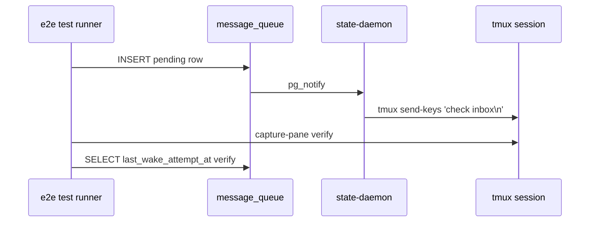

# IMPL: ADF v1.2.3 — Production-like Test Layer + 4-Evidence Discipline (skeleton)

> Honesty labels: [検証済] / [文献確認] / [推測] を主要 claim に付与する。
> 本 IMPL は **skeleton**、impl 着手時に dev-bot が詳細追記。

## 0. 対応する SPEC [必須]

[文献確認: `docs/spec/v1.2.3-test-layer.md`] SPEC-DOC4L-010 (Production-like E2E) + SPEC-DOC4L-011 (4-Evidence) の impl 詳細。

## 1. 配置図 [必須]

### 1.1 新規ファイル (skeleton、impl 段で確定)
- `tests/e2e/launchd-integration.test.sh` (FR-010-1)
- `tests/e2e/wake-verification.test.sh` (FR-010-2)
- `tests/e2e/tmux-send-keys.test.sh` (FR-010-3)
- `templates/project/.github/PR_TEMPLATE_4_EVIDENCE.md` (FR-011-1 evidence section)
- `src/cli/commands/verify-evidence.ts` (FR-011-2 routine 化、CI gate)

### 1.2 変更ファイル
- `templates/project/docs/ops/_template.md` の §3 監視に 4-Evidence routine 追加
- `.github/workflows/ci.yml` に E2E test job 追加 (macOS runner)

### 1.3 削除ファイル
なし

## 2. 型定義 [推測]

### 2.1 4-Evidence schema (TypeScript)

```ts
export interface EvidenceReport {
  commit: string;
  process: string;       // launchctl/pgrep output
  db: string;            // psql -c output
  log: string;           // tail -N output
  tmux: string;          // tmux capture-pane output
  collected_at: string;  // ISO 8601
}
```

## 3. シーケンス [推測 init]

### 3.1 E2E wake test flow (Mermaid)


## 4. エラー処理 [推測]
- e2e test の flaky に対し retry 3 回
- launchd unavailable (Linux CI) → skip with marker

## 5. 既存コードとの取り合い [推測]
- agent-comms-mcp の state-daemon 稼働を前提
- tmux session は `bot-registry.txt` 経由で取得 (ARC scope 外、operational)

## 6. ログ出力 [推測]
- e2e test 結果は CI log + PR comment
- 4-Evidence は `.framework/verify/evidence/{commit}/` に永続化

## 7. 設定値 [推測]
- `ADF_E2E_TEST_RETRY=3`
- `ADF_E2E_TEST_TIMEOUT_SEC=60`

## 8. セキュリティ [文献確認: SPEC §6.3]
- log evidence に PII / secret filter 必須
- evidence 永続化に external API 送信禁止

## 9. トレース [必須]

| FR | impl files |
|---|---|
| SPEC-DOC4L-010-FR-010-1 | `tests/e2e/launchd-integration.test.sh` |
| SPEC-DOC4L-010-FR-010-2 | `tests/e2e/wake-verification.test.sh` |
| SPEC-DOC4L-010-FR-010-3 | `tests/e2e/tmux-send-keys.test.sh` |
| SPEC-DOC4L-011-FR-011-1 | `PR_TEMPLATE_4_EVIDENCE.md` + ops template §3 |
| SPEC-DOC4L-011-FR-011-2 | `src/cli/commands/verify-evidence.ts` + CI gate |

## §Evidence (本 IMPL skeleton の根拠)

### 実 file 引用
- `docs/spec/v1.2.3-test-layer.md` SPEC-DOC4L-010+011 (本 PR で起票)
- `docs/HOW_TO_DEVELOP.md` (PR #130 起票済) §「制御機構選定原則」

### 実 DB query 出力
N/A (本 skeleton は doc layer)

### 実 log 抜粋
N/A

### Web 検索 / 公式 doc URL
- https://www.notion.so/35ad2b26f3dc8122b9f5e513b769d4e4 (制御機構選定原則 canonical)
