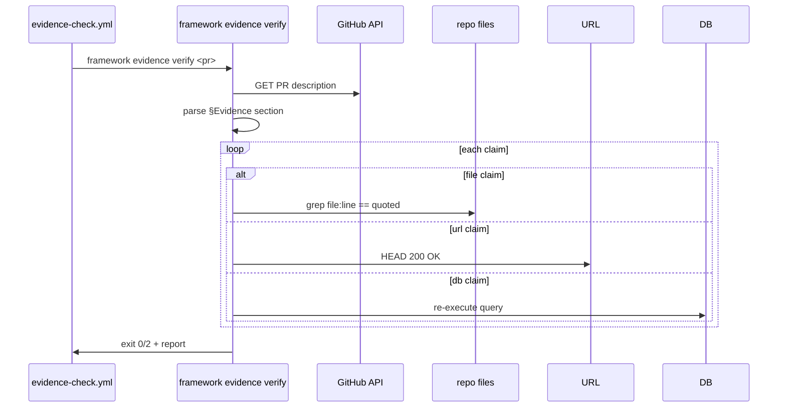

# IMPL: ADF v1.2.5 — Evidence-Based Workflow Discipline (skeleton)

> Honesty labels: [検証済] / [文献確認] / [推測]
> 本 IMPL は **skeleton**、impl 着手時に dev-bot が詳細追記。

## 0. 対応する SPEC [必須]
[文献確認: `docs/spec/v1.2.5-evidence-based-workflow.md`] SPEC-DOC4L-016 FR-001〜FR-006 の impl 詳細。

## 1. 配置図 [必須]

### 1.1 新規ファイル (skeleton)
- `.github/workflows/evidence-check.yml` (FR-002 CI gate)
- `templates/project/.github/PULL_REQUEST_TEMPLATE.md` (FR-005、§Evidence section default)
- `templates/project/.claude/scripts/pre-commit-evidence-check.sh` (FR-003 Hook、case 1)
- `src/cli/commands/evidence/verify.ts` (FR-004)
- `src/cli/commands/evidence/stub.ts` (FR-005)
- `src/lib/evidence/types.ts`
- `src/lib/evidence/parser.ts` (§Evidence section parser)
- `src/lib/evidence/verifier.ts` (file 引用 grep + URL 200 OK + DB query re-execution)

### 1.2 変更ファイル
- `templates/project/docs/spec/_template.md` §Evidence default sub-section 追加 (PR #130 §10 と並列)

### 1.3 削除ファイル
なし

## 2. 型定義 [推測]

```ts
// src/lib/evidence/types.ts
export interface EvidenceClaim {
  type: 'file' | 'db' | 'log' | 'url';
  source: string;        // file:line / psql cmd / log path / URL
  quoted: string;        // 引用 content
  verified?: boolean;
  verifiedAt?: string;
}

export interface EvidenceSection {
  pr_number?: number;
  spec_path?: string;
  claims: EvidenceClaim[];
}

export interface EvidenceVerifyResult {
  ok: boolean;
  total: number;
  verified: number;
  broken: { claim: EvidenceClaim; reason: string }[];
}
```

## 3. シーケンス [推測]

### 3.1 evidence verify CLI flow



## 4. エラー処理 [推測]
- file 引用 broken → exit 2、reason に file:line + diff
- URL 404 → retry 3、warn (block ではない、§9 fail-open)
- DB query unreachable → warn

## 5. 既存コードとの取り合い [推測]
- v1.2.1 hook (Stop/PostToolUse) と並立、conflict なし
- v1.2.3 4-Evidence は CTO routine、本 v1.2.5 は全 dev workflow

## 6. ログ出力 [推測]
- evidence verify result → CI annotation + PR comment
- pre-commit hook log → `.framework/hook-log/evidence-{date}.jsonl`

## 7. 設定値 [推測]
- `ADF_EVIDENCE_STRICT=1` (default 0 で warn only mode、bootstrap)
- `ADF_EVIDENCE_URL_RETRY=3`

## 8. セキュリティ [文献確認: SPEC §6.3]
- §Evidence の log 出力に PII / secret filter
- pre-commit hook の `--no-verify` bypass は audit log に記録 (既 09_ENFORCEMENT §2)

## 9. トレース [必須]

| FR | impl files |
|---|---|
| SPEC-DOC4L-016-FR-001 | `_template.md` §Evidence + `PULL_REQUEST_TEMPLATE.md` |
| SPEC-DOC4L-016-FR-002 | `.github/workflows/evidence-check.yml` |
| SPEC-DOC4L-016-FR-003 | `pre-commit-evidence-check.sh` |
| SPEC-DOC4L-016-FR-004 | `src/cli/commands/evidence/verify.ts` |
| SPEC-DOC4L-016-FR-005 | `PULL_REQUEST_TEMPLATE.md` + `evidence/stub.ts` |
| SPEC-DOC4L-016-FR-006 | CI gate (FR-002) + PR review chain |

## §Evidence (本 IMPL skeleton 根拠 — repo 内引用 only)

### 実 file 引用
- `docs/spec/v1.2.5-evidence-based-workflow.md` SPEC-DOC4L-016 (本 PR で起票、impl はこの SPEC を実装)
- `docs/specs/09_ENFORCEMENT.md` §2 Bypass Audit Log (FR-003 pre-commit + `--no-verify` 連携根拠)
- `templates/project/docs/spec/_template.md` §10 制御機構選定原則 (PR #130 で導入、本 spec が同 section に §Evidence を追加)

### Web URL
- https://www.notion.so/35ad2b26f3dc8122b9f5e513b769d4e4 (制御機構選定原則 canonical)
