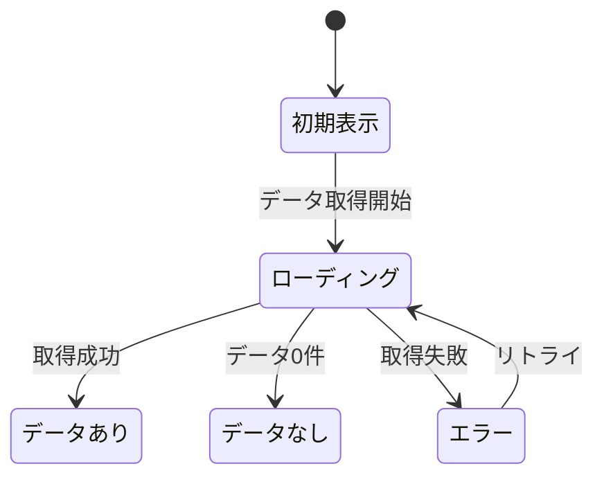

# [機能ID] [機能名] - 機能仕様書（SSOT）

> バージョン: 1.0
> ステータス: Draft / Review / Approved
> 最終更新: YYYY-MM-DD
> 作成者: [名前]
> 承認者: [名前]
> 親タスク: [PT-XXX]

---

## 完全性チェックリスト（実装開始前に全項目 ✅ が必須）

> **このチェックリストが全て ✅ でない場合、実装を開始してはならない。**
> 13_SSOT_AUDIT.md の Pre-Implementation Readiness Check に該当する。

| # | セクション | 必須 | 状態 | 備考 |
|---|-----------|------|------|------|
| 1 | §1 文書情報 | ✅ | ☐ | ID, バージョン, ステータス |
| 2 | §2 機能概要 [CORE] | ✅ | ☐ | 目的, スコープ, ストーリー |
| 3 | §3 機能要件 | ✅ | ☐ | MUST要件が3つ以上 |
| 4 | **§3-E 入出力例** | ✅ | ☐ | **最低5ケース（正常2+異常3）** |
| 5 | **§3-F 境界値** | ✅ | ☐ | **全データ項目の境界パターン** |
| 6 | **§3-G 例外応答** | ✅ | ☐ | **全エラーケースの応答定義** |
| 7 | **§3-H Gherkin テスト** | ✅ | ☐ | **全MUST要件のシナリオ** |
| 8 | §4 データ仕様 [CONTRACT] | ✅ | ☐ | 項目, 型, バリデーション |
| 9 | §5 API仕様 [CONTRACT] | ✅ | ☐ | エンドポイント, リクエスト/レスポンス |
| 10 | §6 UI仕様 | ✅ | ☐ | 画面一覧, レイアウト, 状態遷移 |
| 11 | §7 ビジネスルール [CORE] | ✅ | ☐ | 条件→アクション |
| 12 | §8 非機能要件 [DETAIL] | ✅ | ☐ | 性能目標が数値 |
| 13 | §9 エラーハンドリング [DETAIL] | ✅ | ☐ | 全エラーケース |
| 14 | §10 テストケース | ✅ | ☐ | 正常/異常/境界値 |
| 15 | §11 依存関係 | ✅ | ☐ | 依存する/される機能 |
| 16 | §12 未決定事項 | ✅ | ☐ | CORE/CONTRACT層のTBD=0 |

> **Freeze 状態:**
> ☐☐☐☐ Freeze 1: Domain ⬜ | Freeze 2: Contract ⬜ | Freeze 3: Exception ⬜ | Freeze 4: NFR ⬜
> 実装可能: No（Freeze 2 未完了）

---

## §1 文書情報

| 項目 | 内容 |
|------|------|
| 機能ID | [例: FEAT-001] |
| 機能名 | [例: AI画像分析] |
| ジャンル | [例: 画像分析フロー] |
| 親タスク | [例: PT-001] |
| 優先度 | P0 / P1 / P2 |
| 種別 | 個別機能 |
| 担当 | |
| 推定規模 | S / M / L / XL |

### 変更履歴

| バージョン | 日付 | 変更内容 | 変更者 |
|-----------|------|---------|-------|
| 1.0 | | 初版作成 | |

### 関連ドキュメント

| ドキュメント | 関係 |
|-------------|------|
| SSOT-0_PRD.md §X.X | 要件の根拠 |
| SSOT-1 [機能ID] | 機能カタログの該当行 |
| [関連機能ID] | 依存/連携 |

---

## §2 機能概要 [CORE]

### 2.1 目的
[この機能が存在する理由を1-2文で]

### 2.2 スコープ

#### 含まれるもの
- [MVP で実装する機能・操作]
- [MVP で実装する機能・操作]

#### 含まれないもの（明示的除外）
- [今回実装しないもの]
- [将来検討するもの]

### 2.3 ユーザーストーリー

```
[ペルソナ名] として、
[操作/機能] したい。
なぜなら [達成したい目的] だから。

受け入れ基準:
- [基準1]
- [基準2]
- [基準3]
```

### 2.4 ユーザーフロー

```
1. [ユーザーの操作ステップ1]
2. [ユーザーの操作ステップ2]
3. [システムの応答]
4. [ユーザーの操作ステップ3]
5. [最終結果]
```

---

## §3 機能要件 [CORE: FR] [DETAIL: 入出力例・境界値]

### RFC 2119 準拠の要件リスト

| 要件ID | レベル | 要件 | 検証方法 |
|--------|--------|------|---------|
| FR-001 | MUST | [要件の記述] | [テスト方法] |
| FR-002 | MUST | [要件の記述] | [テスト方法] |
| FR-003 | SHOULD | [要件の記述] | [テスト方法] |
| FR-004 | MAY | [要件の記述] | [テスト方法] |
| FR-005 | MUST NOT | [禁止事項] | [テスト方法] |

### 要件の詳細

#### FR-001: [要件名]
- **レベル**: MUST
- **説明**: [詳細な説明]
- **根拠**: PRD §X.X / ユーザーヒアリング
- **条件**: [前提条件があれば]
- **検証**: [どうテストするか]

---

### §3-E: Example Table（入出力例） [DETAIL]

<!-- ⚠️ REQUIRED: 最低5ケース必須。このセクションが空の場合、実装を開始してはならない。 -->

> **ルール**: 最低5ケース（正常系2 + 異常系3 以上）
> **目的**: 抽象的な要件を具体的な入出力で一意に定める

| # | 入力 | 条件 | 期待出力 | 備考 |
|---|------|------|---------|------|
| 1 | [正常系の入力例] | 正常 | [期待出力] | 基本の正常系 |
| 2 | [正常系のバリエーション] | [条件] | [期待出力] | |
| 3 | [異常系の入力例] | [条件] | [エラー出力] | |
| 4 | [異常系の入力例] | [条件] | [エラー出力] | |
| 5 | [境界値の入力例] | [条件] | [期待出力] | |

---

### §3-F: Boundary Values（境界値） [DETAIL]

<!-- ⚠️ REQUIRED: 全データ項目の境界パターン必須。このセクションが空の場合、実装を開始してはならない。 -->

> **ルール**: 全入力項目について最低5つの境界パターン（最小値/最大値/空/NULL/不正形式）
> **目的**: エッジケースでの振る舞いを明確にし、テスト漏れを防ぐ

| 項目 | 最小値 | 最大値 | 空 | NULL | 不正形式 |
|------|--------|--------|-----|------|---------|
| [項目1] | [値→結果] | [値→結果] | [結果] | [結果] | [結果] |
| [項目2] | [値→結果] | [値→結果] | [結果] | [結果] | [結果] |

---

### §3-G: Exception Response（例外時の戻り） [DETAIL]

<!-- ⚠️ REQUIRED: 全エラーケースの応答定義必須。このセクションが空の場合、実装を開始してはならない。 -->

> **ルール**: 全例外条件に対して、HTTPステータス/エラーコード/メッセージ/リトライ可否/復旧方法を定義
> **目的**: エラー発生時の挙動を一意に決め、実装者が迷わないようにする

| # | 例外条件 | HTTPステータス | エラーコード | ユーザーメッセージ | リトライ可否 | 復旧方法 |
|---|---------|---------------|------------|-----------------|------------|---------|
| 1 | [例外条件] | [4xx/5xx] | [AUTH_xxx/VAL_xxx/...] | [表示メッセージ] | Yes/No | [復旧手段] |
| 2 | | | | | | |
| 3 | | | | | | |

---

### §3-H: Acceptance Tests（Gherkin形式） [DETAIL]

<!-- ⚠️ REQUIRED: 全MUST要件のGherkinシナリオ必須。このセクションが空の場合、実装を開始してはならない。 -->

> **ルール**: 全MUST要件に対応するGherkinシナリオ（正常系+異常系）
> **目的**: テスト自動生成の入力となり、受け入れ基準を検証可能にする

```gherkin
Feature: [FR-XXX] [要件名]

  Scenario: [正常系シナリオ]
    Given [前提条件]
    When [操作]
    Then [期待結果]

  Scenario: [異常系シナリオ]
    Given [前提条件]
    When [操作]
    Then [期待結果]

  Scenario: [境界値シナリオ]
    Given [前提条件]
    When [操作]
    Then [期待結果]
```

---

## §4 データ仕様 [CONTRACT: 4.1] [DETAIL: 4.2, 4.3]

### 4.1 データ項目一覧

| # | 項目名 | 物理名 | 型 | 必須 | デフォルト | バリデーション | 備考 |
|---|--------|--------|-----|------|----------|--------------|------|
| 1 | | | | | | | |
| 2 | | | | | | | |

### 4.2 バリデーションルール

| 項目 | ルール | エラーメッセージ |
|------|-------|----------------|
| | | |

### 4.3 データライフサイクル

```
作成: [いつ、どのように作成されるか]
更新: [いつ、どのように更新されるか]
削除: [削除方式: 物理削除/論理削除/アーカイブ]
保持期間: [いつまで保持するか]
```

---

## §5 API 仕様 [CONTRACT]

### 5.1 エンドポイント一覧

| メソッド | パス | 説明 | 認証 |
|---------|------|------|------|
| POST | /api/v1/xxx | | Required |
| GET | /api/v1/xxx/:id | | Required |

### 5.2 エンドポイント詳細

#### POST /api/v1/xxx

**リクエスト:**
```typescript
interface CreateXxxRequest {
  field1: string;    // [説明]
  field2?: number;   // [説明] (optional)
}
```

**レスポンス（成功: 201）:**
```typescript
interface CreateXxxResponse {
  data: {
    id: string;
    field1: string;
    createdAt: string;
  };
}
```

**レスポンス（エラー）:**
| ステータス | コード | 条件 |
|-----------|--------|------|
| 400 | VAL_xxx | バリデーション失敗 |
| 401 | AUTH_xxx | 未認証 |
| 403 | PERM_xxx | 権限不足 |
| 409 | RES_xxx | 重複 |
| 500 | SYS_xxx | サーバーエラー |

---

## §6 UI 仕様 [CONTRACT: 6.1, 6.4] [DETAIL: 6.2, 6.3, 6.5]

### 6.1 画面一覧

| 画面ID | 画面名 | パス | 認証 |
|--------|--------|------|------|
| | | | |

### 6.2 画面レイアウト

```
[テキストベースのワイヤーフレーム]

┌─────────────────────────────────┐
│ ヘッダー                        │
├─────────────────────────────────┤
│                                 │
│  [主要コンテンツ]               │
│                                 │
├─────────────────────────────────┤
│ フッター / アクションバー       │
└─────────────────────────────────┘
```

### 6.3 状態一覧

| 状態 | 条件 | 表示内容 |
|------|------|---------|
| 初期表示 | | |
| ローディング | | |
| データあり | | |
| データなし（空状態） | | |
| エラー | | |

### 6.4 状態遷移図



### 6.5 操作フロー

| # | ユーザー操作 | システム応答 | 遷移先 |
|---|------------|------------|-------|
| 1 | | | |
| 2 | | | |

---

## §7 ビジネスルール [CORE]

### 7.1 ルール一覧

| ルールID | ルール名 | 条件 | アクション | レベル |
|---------|---------|------|----------|--------|
| BR-001 | | IF [条件] | THEN [動作] | MUST |
| BR-002 | | IF [条件] | THEN [動作] | SHOULD |

### 7.2 ルール詳細

#### BR-001: [ルール名]
- **条件**: [いつ適用されるか]
- **ロジック**: [具体的な処理]
- **例外**: [例外ケース]
- **根拠**: [なぜこのルールか]

---

## §8 非機能要件（ISO 25010 準拠） [DETAIL]

### 8.1 性能
| 指標 | 目標値 | 測定方法 |
|------|-------|---------|
| 応答時間 | [例: 3秒以内] | API レスポンスタイム |
| スループット | [例: 100 req/s] | 負荷テスト |
| データ量 | [例: 10万件まで] | 機能テスト |

### 8.2 セキュリティ
| 要件 | レベル | 対策 |
|------|--------|------|
| 認証 | MUST | [方式] |
| 認可 | MUST | [方式] |
| データ暗号化 | SHOULD | [方式] |
| 入力サニタイズ | MUST | [方式] |

### 8.3 可用性
| 要件 | 目標 |
|------|------|
| 稼働率 | [例: 99.9%] |
| 障害復旧時間 | [例: 1時間以内] |
| データバックアップ | [例: 日次] |

### 8.4 保守性
| 要件 | 対策 |
|------|------|
| ログ出力 | [レベルと内容] |
| モニタリング | [監視項目] |
| デプロイ | [手順] |

---

## §9 エラーハンドリング [DETAIL]

### 9.1 エラーケース一覧

| # | エラー条件 | 種別 | ユーザーメッセージ | システム動作 | 復旧方法 |
|---|----------|------|-----------------|------------|---------|
| 1 | | 入力エラー | | | |
| 2 | | 認証エラー | | | |
| 3 | | 外部API障害 | | | |
| 4 | | タイムアウト | | | |

### 9.2 エラー時のフォールバック

```
外部サービス障害時:
  1. [リトライ回数]回リトライ
  2. [フォールバック動作]
  3. ユーザーに[メッセージ]を表示
  4. エラーログを[レベル]で出力
```

---

## §10 テストケース

### 10.1 正常系

| TC-ID | テスト名 | 前提条件 | 操作 | 期待結果 | 優先度 |
|-------|---------|---------|------|---------|--------|
| TC-N-001 | | | | | P0 |
| TC-N-002 | | | | | P0 |

### 10.2 異常系

| TC-ID | テスト名 | 前提条件 | 操作 | 期待結果 | 優先度 |
|-------|---------|---------|------|---------|--------|
| TC-E-001 | | | | | P0 |
| TC-E-002 | | | | | P0 |

### 10.3 境界値

| TC-ID | テスト名 | 入力値 | 期待結果 |
|-------|---------|--------|---------|
| TC-B-001 | | 最小値 | |
| TC-B-002 | | 最大値 | |
| TC-B-003 | | 空 | |

### 10.4 テストカバレッジ

```
MUST要件: 全てテストケースが存在すること
SHOULD要件: 主要なケースのテストが存在すること
MAY要件: テスト任意
```

---

## §11 依存関係・影響範囲

### 11.1 依存する機能

| 依存先 | 依存内容 | 影響度 |
|--------|---------|--------|
| [機能ID] | [何を使うか] | 高/中/低 |

### 11.2 依存される機能

| 依存元 | 依存内容 | 影響度 |
|--------|---------|--------|
| [機能ID] | [何が使われるか] | 高/中/低 |

### 11.3 外部サービス依存

| サービス | 用途 | 障害時の影響 | フォールバック |
|---------|------|------------|--------------|
| | | | |

---

## §12 未決定事項・制約

### 12.1 未決定事項（TBD）

| # | 項目 | 層 | 理由 | Decision Backlog ID |
|---|------|-----|------|-------------------|
| | | CORE/CONTRACT/DETAIL | | DB-XXX |

**注意:**
- CORE層・CONTRACT層のTBD: 監査合格にはゼロであること
- DETAIL層のTBD: Decision Backlog に記録済みなら許容（デフォルト案で実装可）

### 12.2 前提条件

- [前提1]
- [前提2]

### 12.3 制約事項

- [制約1]
- [制約2]

---

## 監査情報

| 項目 | 内容 |
|------|------|
| 監査日 | |
| 監査スコア | /100 |
| 合格判定 | 合格 / 条件付き合格 / 不合格 |
| 指摘事項数 | Critical: / Major: / Minor: |
| 監査詳細 | 13_SSOT_AUDIT.md 参照 |
