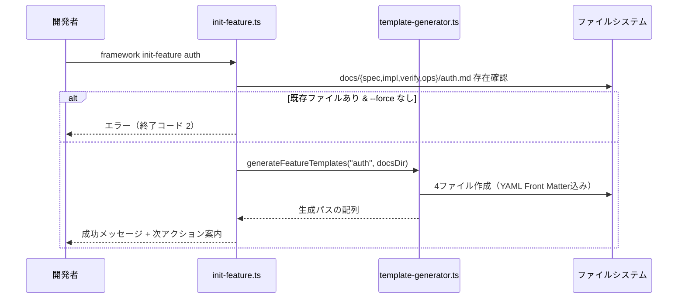
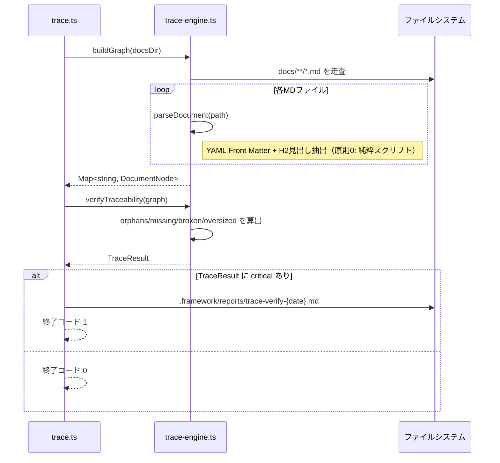
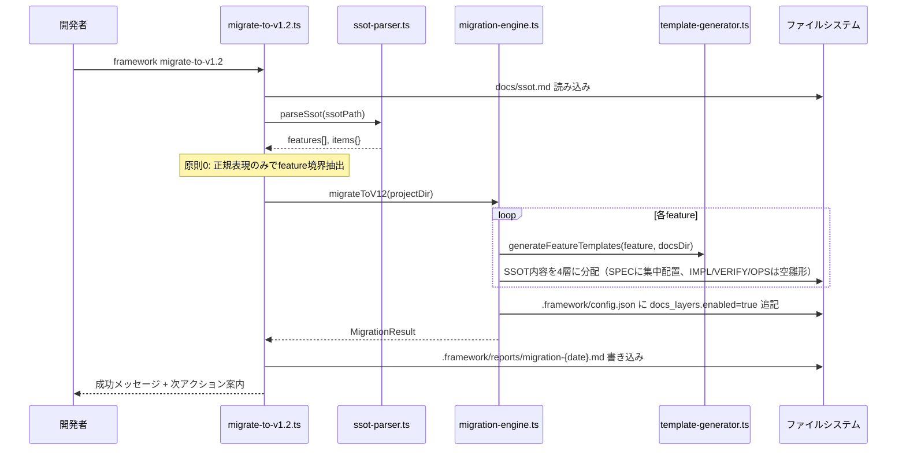

# IMPL: 4層ドキュメント体系導入

## 0. 対応するSPEC

- SPEC-ID: SPEC-DOC4L-001〜007
- SPEC パス: `docs/spec/doc4l.md`

---

## 原則 0 の実装上の徹底

本実装は例外なくスクリプト制御に従う。具体的な徹底事項：

1. **CLI 実装に LLM 呼び出しを書かない**: `src/cli/commands/*.ts` と `src/cli/lib/*.ts` から `claude -p` / `spawn('claude')` / OpenAI API / Codex API 等への直接呼び出しを禁止
2. **Validator は関数として呼び出す**: Gate 1 の `traceability-auditor` は CLI から**呼ばれる**側。呼ぶかどうか・順序・入力・タイムアウトは全てスクリプトが決定
3. **静的解析で担保**: `test/principle0.test.ts` を新設し、`src/cli/` 配下に LLM 呼び出しパターンが存在しないことを自動検証（VERIFY-DOC4L-007）

---

## 1. 配置図

### 1.1 新規ファイル

```
ai-dev-framework/
├── src/cli/
│   ├── commands/
│   │   ├── init-feature.ts              新規: 4ファイル雛形生成
│   │   ├── trace.ts                     新規: framework trace verify/graph
│   │   └── migrate-to-v1.2.ts           新規: マイグレーション
│   └── lib/
│       ├── trace-engine.ts              新規: Front Matter 解析 + ID 参照検証
│       ├── template-generator.ts        新規: 4層ファイル雛形生成
│       ├── gate-spec-validator.ts       新規: Gate 0 バリデータ
│       ├── migration-engine.ts          新規: SSOT → 4層雛形変換
│       └── ssot-parser.ts               新規: 既存SSOTの正規表現パーサ
├── templates/project/docs/
│   ├── spec/_template.md                新規: SPEC テンプレート（STRIDE強化版）
│   ├── impl/_template.md                新規: IMPL テンプレート
│   ├── verify/_template.md              新規: VERIFY テンプレート
│   └── ops/_template.md                 新規: OPS テンプレート
├── .claude/agents/validators/
│   └── traceability-auditor.md          新規: Gate 1 拡張用 Validator
├── .claude/gates/
│   └── spec-validation.md               新規: Gate 0 定義
├── test/
│   └── principle0.test.ts               新規: LLM非依存の静的検証
└── docs/
    └── specs/
        └── 07_DOCUMENTATION_v1.2.0.md   新規: 4層体系のSSOT
```

### 1.2 変更ファイル

```
src/cli/commands/gate.ts                           Gate 0 (spec) サブコマンド追加
src/cli/lib/gate-check-engine.ts                   gate-spec-validator 呼び出し追加
src/cli/lib/gate-quality-engine.ts                 ssot-drift-detector の比較対象を IMPL に
.claude/agents/validators/ssot-drift-detector.md   比較対象を IMPL に変更
.claude/gates/design-validation.md                 traceability-auditor 追加
templates/project/.framework/config.json           docs_layers セクション追加
templates/project/CLAUDE.md                        4層体系の説明追加
```

### 1.3 削除ファイル

なし（v1.1 系統との互換性維持のため）。

---

## 2. 型定義

### 2.1 データ型

```typescript
// src/cli/lib/trace-engine.ts

export type LayerType = 'spec' | 'impl' | 'verify' | 'ops';

export interface FrontMatter {
  id: string;                      // 例: "SPEC-AUTH-001"
  traces: {
    spec?: string[];
    impl?: string[];
    verify?: string[];
    ops?: string[];
  };
  status: 'Draft' | 'Frozen' | 'Deprecated';
}

export interface DocumentNode {
  id: string;
  layer: LayerType;
  path: string;
  frontMatter: FrontMatter;
  sections: string[];              // H2 見出しのリスト
}

export interface TraceResult {
  orphans: DocumentNode[];         // 参照されていない孤立ドキュメント
  missing: { from: string; expected: LayerType; expectedId: string }[];
  broken: { from: string; to: string; reason: string }[];
  oversizedFeatures: { feature: string; idCount: number }[];  // ID 100超
  totalNodes: number;
  passCount: number;
}

export interface GateSpecResult {
  status: 'PASS' | 'BLOCK';
  critical: {
    docId: string;
    type: 'MissingAcceptanceCriteria' | 'STRIDE_NA_WithoutReason' | 'MissingRequiredSection';
    message: string;
  }[];
  warnings: { docId: string; type: string; message: string }[];
}

export interface MigrationResult {
  discoveredFeatures: string[];
  generatedFiles: string[];
  skippedFiles: { path: string; reason: string }[];
  configUpdated: boolean;
}
```

### 2.2 関数シグネチャ

```typescript
// trace-engine.ts
export function parseDocument(path: string): DocumentNode | null;
export function buildGraph(docsDir: string): Map<string, DocumentNode>;
export function verifyTraceability(graph: Map<string, DocumentNode>): TraceResult;
export function renderGraph(graph: Map<string, DocumentNode>, format: 'mermaid'): string;

// template-generator.ts
export function generateFeatureTemplates(featureName: string, outputDir: string): Promise<string[]>;
export function loadTemplate(layer: LayerType): string;

// gate-spec-validator.ts
export function validateSpec(specPath: string): GateSpecResult;

// migration-engine.ts
export function migrateToV12(projectDir: string): Promise<MigrationResult>;

// ssot-parser.ts
export function parseSsot(ssotPath: string): { features: string[]; items: Map<string, string[]> };
```

### 2.3 CLI 契約

```
framework init-feature <n> [--layers spec,impl,verify,ops] [--force]
framework trace verify [--dir <docsDir>]
framework trace graph [--format mermaid|json] [--out <path>]
framework gate spec [--dir <docsDir>]
framework migrate-to-v1.2 [--dry-run] [--ssot <path>]
```

終了コード規約:
- 0: PASS
- 1: BLOCK
- 2: CLI エラー（引数不正等）

---

## 3. シーケンス

### 3.1 `framework init-feature auth` の正常系



### 3.2 `framework trace verify` の正常系



### 3.3 `framework migrate-to-v1.2` の正常系



### 3.4 トランザクション境界

- ファイル生成は all-or-nothing（途中失敗したら生成済みを削除）
- マイグレーションは feature 単位で atomic（1 feature の 4 ファイルが全て生成されたら次へ）
- トレース検証は読み取りのみ、副作用なし

### 3.5 並行性

- `framework init-feature` は同一 feature 名の同時実行を禁止（`.framework/locks/init-{feature}.lock` で排他）
- `framework trace verify` は並行実行可（読み取りのみ）
- `framework migrate-to-v1.2` は排他実行（`.framework/locks/migration.lock`）

---

## 4. エラー処理

### 4.1 例外分類

| 例外クラス | 発生条件 | 伝播先 | ユーザー表示 | 終了コード |
|---|---|---|---|---|
| `FeatureAlreadyExists` | `init-feature` で既存検出 | CLI | 「feature '<n>' は既に存在。--force で上書き」 | 2 |
| `InvalidFrontMatter` | YAML パース失敗 | trace-engine | 「{path}: Front Matter 不正」 | 1 |
| `OrphanDocument` | 参照されていないドキュメント | trace-engine | WARNING | 0（閾値内）or 1 |
| `MissingTrace` | SPEC に対応 IMPL なし等 | trace-engine | CRITICAL | 1 |
| `BrokenReference` | 存在しない ID を参照 | trace-engine | CRITICAL | 1 |
| `STRIDE_NA_WithoutReason` | STRIDE で「N/A」のみ（理由なし） | gate-spec | CRITICAL | 1 |
| `MigrationConflict` | マイグレーション先ファイルが既存 | migration-engine | 「--dry-run で事前確認、競合ファイルを確認」 | 2 |
| `SsotParseError` | SSOT の構造が正規表現で抽出不能 | ssot-parser | 「SSOT 構造が規定外。手動変換を推奨」 | 2 |

### 4.2 リトライ方針

- ファイル I/O 失敗は即エラー（リトライなし、ローカル FS のため）
- マイグレーション中の失敗は atomic 単位でロールバック、ユーザーに原因提示

### 4.3 フォールバック

- テンプレート読み込み失敗時は CLI 同梱のデフォルトテンプレート（`src/cli/templates/` に埋め込み）を使用

---

## 5. 既存コードとの取り合い

### 5.1 依存する既存モジュール

- `src/cli/lib/gate-check-engine.ts`: Gate 0 の結果を既存 Gate A/B/C と同じ出力フォーマットで返す（`runPreCodeCheck` の出力型に合わせる）
- `src/cli/commands/gate.ts`: `gate` コマンドのサブコマンドルーティングに `spec` を追加
- `.claude/agents/validators/ssot-drift-detector.md`: prompt 内の比較対象を `docs/ssot.md` から `docs/impl/**/*.md` に変更

### 5.2 拡張する既存関数

- `runDesignValidation`（Gate 1）: `traceability-auditor` を 4 番目の Validator として追加（既存 3 体と並列実行、閾値 WARNING ≤ 3 を維持）
- `ssot-drift-detector` の prompt: 「SSOT」の定義を「IMPL 層ドキュメント」に変更。`enabled: false` のプロジェクトでは従来どおり `docs/ssot.md` を参照

### 5.3 非互換変更の有無

**ON/OFF 切替時の挙動のみ変更**。

- `docs_layers.enabled` が設定されていない既存プロジェクト → v1.1 互換モードで動作（INFO ログのみ、機能的な影響なし）
- `docs_layers.enabled: true` に切り替えた瞬間から 4 層必須（BLOCK が出る可能性あり）
- 切替前のマイグレーションを公式推奨フローとする（OPS.md §1.2 参照）

---

## 6. ログ出力

### 6.1 出力ポイント

| イベント | レベル | 出力先 | 含める情報 |
|---|---|---|---|
| `init-feature` 開始 | INFO | stdout | feature 名、対象ディレクトリ |
| ファイル生成 | INFO | stdout | 生成パス |
| `init-feature` 失敗 | ERROR | stderr | エラー種別、原因 |
| `trace verify` 開始 | INFO | stdout | docs ディレクトリ |
| トレース検証結果 | INFO/WARN/ERROR | stdout + レポート | 未対応一覧、統計値 |
| Gate 0 判定 | INFO | stdout | PASS/BLOCK、CRITICAL 一覧、WARNING 数 |
| `migrate-to-v1.2` 進捗 | INFO | stdout | feature 発見数、生成数、スキップ数 |

### 6.2 監視連携

- CLI なのでメトリクス出力なし。`.framework/reports/*.md` を CI に集約することで、トレース網羅率・マイグレーション成功率の推移を観測可能。

---

## 7. 設定値

`.framework/config.json` に追加:

```json
{
  "profile": "app",
  "provider": { "default": "claude" },
  "docs_layers": {
    "enabled": true,
    "root": "docs",
    "layers": {
      "spec": "spec",
      "impl": "impl",
      "verify": "verify",
      "ops": "ops"
    }
  }
}
```

`enabled: false` で v1.1 互換モード。中間グラデーション（strict オプション等）は提供しない。

---

## 8. セキュリティ

原則0とSPEC §6.3 に準拠。具体的な実装上の対策：

- テンプレート生成時のファイルパスは `path.resolve` + `path.relative` でプロジェクトルート外への書き込みを防ぐ
- `--dir` / `--ssot` オプションの引数は whitelist 検証（英数字＋ハイフン＋スラッシュ＋ドットのみ）
- Front Matter パースは `js-yaml` の SAFE_SCHEMA を使用（任意コード実行の回避）
- Front Matter サイズ上限 1MB、パース 5 秒タイムアウト
- マイグレーション時の SSOT 読み込みも上記同様

---

## 9. トレース

- SPEC: SPEC-DOC4L-001〜007
- VERIFY: VERIFY-DOC4L-001〜007
- OPS: OPS-DOC4L-001（デプロイ）, OPS-DOC4L-002（マイグレーション手順）

---

# 付録 A: 4層テンプレート節立て定義

以下が `templates/project/docs/{layer}/_template.md` として生成されるテンプレート本体。

## A.1 SPEC テンプレート（What）

```markdown
---
id: SPEC-{FEATURE}-{NNN}
status: Draft
traces:
  impl: []
  verify: []
---

# SPEC: {feature-name}

## 0. メタ
- 作成日:
- 関連ADR:

## 1. 目的 (Goals) [必須]
## 2. 非目的 (Non-goals) [必須]
## 3. ユーザーストーリー [必須]

## 4. 機能要件 (Core) [必須]
### 4.1 [SPEC-{FEATURE}-001] <要件名>

## 5. インターフェース (Contract) [必須]
### 5.1 API契約（OpenAPI フラグメント推奨）
### 5.2 DBスキーマ
### 5.3 イベント/メッセージ [該当時]

## 6. 非機能要件 (Detail) [必須]
### 6.1 性能
### 6.2 可用性 (SLO)

### 6.3 セキュリティ要件 [app/api プロファイルで必須]

#### 6.3.1 脅威モデル (STRIDE)
| カテゴリ | 該当内容 |
|---|---|
| Spoofing（なりすまし） | |
| Tampering（改ざん） | |
| Repudiation（否認） | |
| Information Disclosure（情報漏洩） | |
| Denial of Service（DoS） | |
| Elevation of Privilege（権限昇格） | |

※「N/A」は理由を明記。単なる N/A は Gate 0 で BLOCK される。

#### 6.3.2 OWASP Top 10:2021 マッピング
- A01:2021 Broken Access Control:
- A02:2021 Cryptographic Failures:
- A03:2021 Injection:
- A04:2021 Insecure Design:
- A05:2021 Security Misconfiguration:
- A06:2021 Vulnerable and Outdated Components:
- A07:2021 Identification and Authentication Failures:
- A08:2021 Software and Data Integrity Failures:
- A09:2021 Security Logging and Monitoring Failures:
- A10:2021 Server-Side Request Forgery:

（該当する項目のみ記入、N/A は理由必須）

#### 6.3.3 データ分類
- 本 feature が扱うデータ:
  - [ ] PII（個人識別情報）
  - [ ] PCI（決済カード情報）
  - [ ] 機密（社内機密、顧客機密）
  - [ ] 公開
- 分類に応じた追加要件:

### 6.4 監査ログ要件 [該当時]

## 7. 受入基準 (Acceptance Criteria) [必須・Gherkin形式]
### 7.1 [SPEC-{FEATURE}-001] の受入基準
```gherkin
Feature: {feature-name}
  Scenario:
    Given
    When
    Then
```

## 8. 前提・依存 [必須]
## 9. リスクと緩和策 [該当時]
```

**書く深さ:** 機能要件は「何を」のみ、実装手段は書かない。受入基準は Gherkin で**具体的な入出力**を書く（抽象的な "should work correctly" は NG）。STRIDE / OWASP / データ分類は app/api プロファイルで必須、N/A は理由付きでのみ許可。

## A.2 IMPL テンプレート（How）

```markdown
---
id: IMPL-{FEATURE}-{NNN}
status: Draft
traces:
  spec: [SPEC-{FEATURE}-001]
  verify: []
  ops: []
---

# IMPL: {feature-name}

## 0. 対応するSPEC [必須]

## 1. 配置図 [必須]
### 1.1 新規ファイル
### 1.2 変更ファイル
### 1.3 削除ファイル [該当時]

## 2. 型定義 [必須]
### 2.1 データ型（TypeScript / OpenAPI 抜粋）
### 2.2 関数シグネチャ
### 2.3 API契約（該当時、OpenAPI フラグメント）

## 3. シーケンス [必須]
### 3.1 正常系フロー（Mermaid sequenceDiagram）
### 3.2 トランザクション境界
### 3.3 並行性 [該当時]

## 4. エラー処理 [必須]
### 4.1 例外分類（表形式：例外名 / 発生条件 / 伝播先 / ユーザー表示 / 終了コード）
### 4.2 リトライ方針
### 4.3 フォールバック [該当時]

## 5. 既存コードとの取り合い [必須]
### 5.1 依存する既存モジュール
### 5.2 拡張する既存関数
### 5.3 非互換変更の有無

## 6. ログ出力 [必須]
### 6.1 出力ポイント（表形式）
### 6.2 監視連携 [該当時]

## 7. 設定値 [該当時]

## 8. セキュリティ [SPEC §6.3 の実装詳細]

## 9. トレース [必須]
```

**書く深さ:** 型とシグネチャは確定値を書く。アルゴリズムの細部（ループの書き方、変数名）は書かない。「既存コードとの取り合い」は関数名レベルまで具体的に。疑似コードは不要、コード断片は型定義と API 契約のみ。

## A.3 VERIFY テンプレート（Prove）

```markdown
---
id: VERIFY-{FEATURE}-{NNN}
status: Draft
traces:
  spec: [SPEC-{FEATURE}-001]
  impl: [IMPL-{FEATURE}-001]
---

# VERIFY: {feature-name}

## 0. 対応するSPEC / IMPL [必須]

## 1. 機能テスト（Gherkin） [必須]
### 1.1 [VERIFY-{FEATURE}-001] 正常系: <シナリオ名>
Feature:
  Scenario:
    Given
    When
    Then

## 2. 境界値テスト [必須]
表形式: 項目 / 境界 / 期待値

## 3. 異常系テスト [必須]
表形式: 入力 / 期待するエラー / エラーコード

## 4. 認証/認可テスト [app/api プロファイルで必須]
表形式: ロール / 操作 / 期待結果

## 5. パフォーマンステスト [該当時]
表形式: 項目 / 基準値 / 計測方法

## 6. セキュリティテスト [app/api プロファイルで必須]
表形式: 攻撃ベクタ（STRIDE/OWASP 参照）/ 想定結果

## 7. Definition of Done [必須]
チェックボックス形式

## 8. トレース [必須]
```

**書く深さ:** 全受入基準（SPEC §7）に対して VERIFY §1 のシナリオを 1:1 対応。境界値・異常系は**具体的な値**を書く（"invalid input" は NG、"email = '' (空文字)" と書く）。セキュリティテストは SPEC §6.3.1〜6.3.3 の各項目に対応。

## A.4 OPS テンプレート（Run）

```markdown
---
id: OPS-{FEATURE}-{NNN}
status: Draft
traces:
  spec: [SPEC-{FEATURE}-001]
  impl: [IMPL-{FEATURE}-001]
---

# OPS: {feature-name}

## 0. 対応するSPEC / IMPL [必須]

## 1. デプロイ手順 [必須]
### 1.1 前提条件
### 1.2 手順（番号付き、コマンド含む）
### 1.3 デプロイ後確認

## 2. ロールバック手順 [必須]
### 2.1 ロールバック条件
### 2.2 手順

## 3. 監視項目 [必須]
表形式: メトリクス名 / 正常範囲 / アラート条件 / 通知先

## 4. SLO [必須]
表形式: SLI / 目標値 / 測定方法 / エラーバジェット

## 5. 障害対応 Runbook [必須、3症状以上]
### 5.1 症状: <よくある障害パターン>
- 一次対応:
- エスカレーション:
- 再発防止:

## 6. 定期メンテナンス [該当時]

## 7. バックアップ・リストア [該当時]
### 7.1 対象・頻度
### 7.2 RTO / RPO

## 8. 権限管理 [app/api プロファイルで必須]

## 9. トレース [必須]
```

**書く深さ:** コマンドは**コピペで動く形**で書く。SLO は数値で（"高速" は NG、"p95 レイテンシ 300ms 以下" と書く）。Runbook の障害パターンは最低 3 件。新規 feature で OPS が 1 ページで終わることは稀——短いなら考慮漏れを疑う。

---

# 付録 B: 実装段階（v1.2.x の Step 計画）

| Step | 対応バージョン | スコープ | 期間 |
|---|---|---|---|
| 1 | **v1.2.0** | IMPL テンプレ + `init-feature` + `trace verify` + Gate 1 拡張 + **`migrate-to-v1.2`（必須）** | 3週 |
| 2 | v1.2.1 | VERIFY テンプレ + Gate 0 新設 + Gherkin 構文検証 + SPEC テンプレの STRIDE/OWASP/データ分類必須化 | 2週 |
| 3 | v1.2.2 | OPS テンプレ + Gate D 拡張 + SLO 必須チェック + ssot-drift-detector の比較対象を IMPL に切替 | 2週 |
| 4 | v1.3.x 以降 | STRIDE 内容の LLM 品質判定、OpenAPI スキーマ自動検証、C4 自動生成、reverse-impl（AST 解析） | 継続 |

各 Step 完了時に haishin-puls-hub で 1 feature 実戦適用して精度測定（既存 Gate 1/2/3 の精度測定と同じ手順）。

**v1.2.0 スコープ確定理由**: マイグレーションツールなしに ON/OFF 二値化を出すと、既存プロジェクトが v1.2 に移行できず OSS 採用が進まない。migration を v1.2.0 必須に格上げしたため、v1.2.x の他スコープは後ろ倒し。
